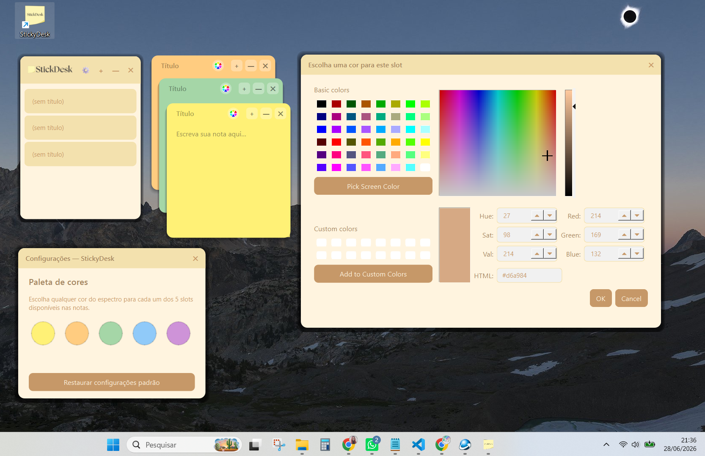
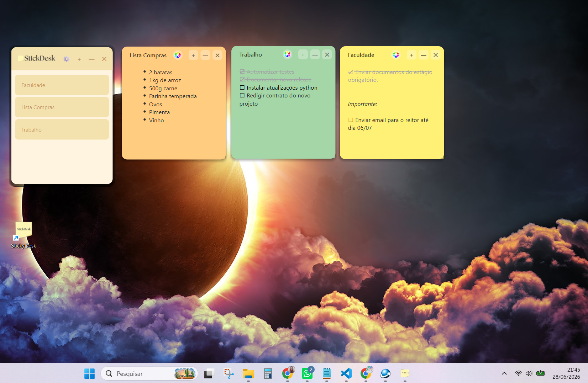

# StickyDesk


> Post-its digitais para sua área de trabalho.
> **Versão atual: v1.3.0**

StickyDesk é uma aplicação desktop desenvolvida em Python e PySide6 que permite criar post-its digitais diretamente na área de trabalho do Windows.

Projetado para ser leve, rápido e intuitivo, o StickyDesk ajuda a organizar lembretes, ideias e tarefas sem interromper o fluxo de trabalho.

---

# 📸 Demonstração


---


---

# ✨ Funcionalidades

## MVP

* Criar post-its
* Editar conteúdo em tempo real
* Arrastar notas pela tela
* Personalizar cores
* Salvamento automático
* Persistência local
* Reabertura automática das notas salvas

---

## Funcionalidades Planejadas

* Atalhos de teclado
* Suporte a Markdown
* Checklists
* Exportação de notas

---

## Novidades da v1.3.0

- 🚫 **Sem ícone na bandeja** — todo o controle do app agora passa pela janela painel e pelos botões de cada nota
- 📋 **Painel de controle** — uma mini janela abre junto com as notas, listando os títulos de todas elas; clique em um item para restaurar/focar aquela nota
- 📝 **Comportamento "Bloco de Notas"** — ao abrir o app, todas as notas salvas aparecem automaticamente; se não houver nenhuma, uma nota em branco é criada
- ➕ **Nova nota direto da nota** — botão `+` no cabeçalho de cada nota, ao lado de minimizar e excluir
- 🗕 **Minimizar de verdade** — o botão `—` de cada nota manda ela para a barra de tarefas (não fecha)
- 🗑️ **Excluir continua exigindo confirmação** — botão `✕` apaga a nota permanentemente
- 💾 **Persistência em AppData** — os dados ficam em `%APPDATA%\StickyDesk\notes.json`, compatível com instalação em `Program Files`
- 📦 **Distribuição via instalador** — build com PyInstaller + instalador visual com Inno Setup

# 🖥️ Tecnologias

* Python
* PySide6
* JSON (persistência local)

---

# 🏗️ Arquitetura

O projeto segue uma arquitetura simples baseada em separação de responsabilidades, facilitando manutenção, testes e futuras expansões.

```text
UI
 ├── Interface gráfica
 ├── Componentes visuais
 └── Eventos do usuário

Services
 ├── Regras de negócio
 ├── Manipulação das notas
 └── Fluxos da aplicação

Models
 ├── Estruturas de dados
 └── Representação das notas

Storage
 ├── Leitura de arquivos
 ├── Escrita de arquivos
 └── Persistência JSON
```

---

# 📂 Estrutura do Projeto

```
stickydesk/
│
├── app/
│   ├── models/
│   │   └── note.py              # Dataclass Note — domínio puro (+ width/height)
│   │
│   ├── services/
│   │   ├── note_service.py      # CRUD, geração de ID, cor inicial via paleta
│   │   └── settings_service.py  # Paleta de 5 cores personalizável + restaurar padrão
│   │
│   ├── storage/
│   │   └── json_storage.py      # Leitura/escrita no arquivo JSON
│   │
│   └── ui/
│       ├── main_window.py       # Painel: logo, engrenagem, lista de notas, minimizar/fechar tudo
│       ├── settings_dialog.py   # Diálogo de configurações de paleta
│       ├── live_markdown_editor.py  # QTextEdit com markdown→rich text em tempo real
│       └── sticky_note.py       # Widget visual da nota (dobra, resize, botões)
│
├── assets/
│   ├── icon.ico                 # Ícone do executável (adicionar manualmente)
│   └── logo.png                 # Logo do painel principal (adicionar manualmente)
│
├── main.py                      # Ponto de entrada + DI manual + caminho AppData
├── build.bat                    # Pipeline local: venv + deps + PyInstaller
├── instalador.iss               # Script do Inno Setup
├── requirements.txt             # Dependências de produção (PySide6)
├── requirements-dev.txt         # Dependências de build (PyInstaller)
└── .gitignore
```
### Fluxo de dados

```
main.py
  └─ instancia JsonStorage (notes.json) + SettingsService (settings.json)
     + NoteService(storage, settings) + MainWindow(service, settings)
        │
        ├─ MainWindow carrega todas as notas salvas via NoteService.get_all()
        │    ├─ se não houver nenhuma → cria uma nota em branco
        │    └─ para cada Note → cria StickyNoteWidget(palette=settings.get_colors())
        │
        ├─ Usuário interage com StickyNoteWidget
        │    ├─ on_content_change  → NoteService.update_content()  → JsonStorage.save()
        │    ├─ on_title_change    → NoteService.update_title()    → JsonStorage.save() + lista
        │    ├─ on_position_change → NoteService.update_position() → JsonStorage.save()
        │    ├─ on_size_change     → NoteService.update_size()     → JsonStorage.save()
        │    ├─ on_color_change    → NoteService.update_color()    → JsonStorage.save()
        │    ├─ on_new_note        → MainWindow._create_note()     → cria + spawna novo widget
        │    └─ on_delete          → NoteService.delete()          → JsonStorage.save() + lista
        │
        └─ Usuário abre configurações (⚙)
             └─ SettingsDialog → SettingsService.set_color()/restore_defaults()
                  → on_palette_change → MainWindow propaga para StickyNoteWidget.update_palette()
                    em todas as notas já abertas
```
---

### Princípios seguidos

- **Markdown é convertido ao digitar, não em lote**: `LiveMarkdownEditor` intercepta cada tecla e aplica negrito/itálico/lista/checkbox no instante em que o padrão é reconhecido, removendo os marcadores (`**`, `*`, `-`, `[ ]`) do texto — o resultado já é rich text, sem etapa de preview separada
- **Resize é estado de janela, persistido explicitamente**: `width`/`height` vivem no modelo `Note` e são salvos só quando o arrasto termina (`mouseReleaseEvent`), não a cada pixel
- **Paleta de cores é configuração, não dado de nota**: vive em `settings.json` separado; mudar a paleta não afeta a cor já escolhida de notas existentes, só as opções disponíveis para escolha futura
- **Sem tray, sem menu de contexto**: todo controle é feito por botões visíveis nas próprias janelas
- **Debounce de auto-save**: texto e título são salvos 500 ms após parar de digitar
- **Persistência fora da área de instalação**: dados em AppData, nunca em Program Files
- **DI manual em `main.py`**: dependências compostas externamente, facilitando testes

---

### Paleta de cores disponível

| Cor | Hex |
|---|---|
| Amarelo suave | `#fff176` |
| Laranja suave | `#ffcc80` |
| Verde suave | `#a5d6a7` |
| Azul suave | `#90caf9` |
| Lilás suave | `#ce93d8` |

---

# 📦 Instalação (Para Usuários)

A jornada de instalação do StickyDesk é simples e integrada ao padrão Windows. Não é necessário ter o Python instalado na máquina.

1. Baixe o instalador mais recente (`StickyDesk_Setup.exe`) na aba de [Releases](https://github.com).
2. Execute o instalador e avance pelas telas do assistente.
3. Marque a opção para criar um atalho na **Área de Trabalho**.
4. Clique em **Concluir** para abrir o StickyDesk automaticamente.

> 💡 **Onde ficam os meus dados?** Suas notas são salvas de forma segura e automática na pasta do seu usuário do Windows em `%APPDATA%\StickyDesk\notes.json`. Atualizar ou reinstalar o aplicativo não apagará seus lembretes.

---

# 🛠️ Desenvolvimento e Lançamento (Para Programadores)

Se você deseja modificar o código-fonte, testar localmente, gerar novas versões do executável ou publicar um lançamento oficial, siga os passos abaixo.

### 1. Preparação do Ambiente

Clone o repositório e entre na pasta do projeto:
```bash
git clone https://github.com/FasesDaLunaAurora/StickyDesk.git
cd stickydesk
```

Crie o ambiente virtual e ative-o:
```powershell
python -m venv .venv
.\.venv\Scripts\Activate.ps1
```

Instale as dependências da aplicação:
```bash
python -m pip install --upgrade pip
python -m pip install -r requirements.txt
```

### 2. Executando em Modo de Desenvolvimento

Para rodar a aplicação diretamente pelo código-fonte com o terminal ativo:
```bash
python main.py
```

### 3. Gerando uma Nova Versão (Compilação)

O projeto possui um script centralizador que ativa o ambiente virtual, garante as ferramentas necessárias e gera o executável autônomo.

1. Certifique-se de que as dependências de empacotamento estão listadas em `requirements-dev.txt`.
2. No terminal, execute o script de automação:
   ```powershell
   cmd /c .\build.bat
   ```
3. O executável standalone será gerado em: `dist/StickyDesk.exe`.

> **Sobre o arquivo `StickyDesk.spec`**: o PyInstaller gera esse arquivo automaticamente na primeira execução do `build.bat`. Ele guarda a "receita" da compilação (ícone, modo janela, módulos incluídos) para reuso. É artefato gerado, não código-fonte — já está no `.gitignore` e pode ser apagado/recriado sem problema a qualquer momento (basta rodar `build.bat` de novo).

### 4. Criando o Instalador Visual

Para gerar o assistente de instalação final (`StickyDesk_Setup.exe`):
1. Instale o [Inno Setup](https://jrsoftware.org) no seu Windows.
2. Abra o Inno Setup Compiler.
3. Carregue o arquivo `instalador.iss` localizado na raiz deste projeto.
4. Clique em **Compile** (ícone de Play). O instalador será gerado na pasta `installer_output/`.

---

### 🚀 5. Publicando uma Nova Release no GitHub

Siga este processo padronizado para disponibilizar o instalador gerado na página oficial do repositório:

1. **Consolide os commits:** Garanta que todas as alterações e a limpeza do `.gitignore` já estão mescladas e enviadas para a branch principal:
   ```powershell
   git checkout main
   git pull origin main
   ```
2. **Acesse as Releases:** Na página do repositório no navegador, localize a seção **Releases** na coluna direita e clique em **Create a new release** (ou *Draft a new release*).
3. **Configure a Tag e o Título:** 
   - No campo **Choose a tag**, digite a nova versão (ex: `v1.1.0`) e clique em *Create new tag*. Garanta que o alvo (*Target*) seja a branch `main`.
   - No campo **Release title**, nomeie o lançamento (ex: `StickyDesk v1.1.0 - Instalador e Persistência`).
4. **Anexe o Instalador (Binário):**
   - > ⚠️ **AVISO:** Nunca suba arquivos `.exe` diretamente via commits do Git. Eles devem ser anexados exclusivamente aqui.
   - Role até a área pontilhada (*Attach binaries...*) e **arraste e solte** o arquivo `StickyDesk_Setup.exe` (que está na pasta `installer_output/`) lá dentro. Aguarde o carregamento concluir.
5. **Publique:** Garanta que a opção **Set as the latest release** está marcada e clique no botão verde **Publish release**.


## Como usar

| Ação | Como fazer |
|---|---|
| **Abrir o app** | Duplo clique no atalho da área de trabalho (ou `python main.py`) |
| **Criar nota** | Botão direito no ícone da bandeja → *Nova nota* |
| **Editar título** | Clique no campo de texto no topo da nota e digite |
| **Editar conteúdo** | Clique na área de texto da nota e digite |
| **Mover nota** | Arraste pela barra superior (fora do campo de título) |
| **Trocar cor** | Clique em um dos círculos coloridos na barra |
| **Fechar nota (sem perder)** | Botão `—` no canto superior direito — a nota some da tela, mas fica salva |
| **Reabrir notas fechadas** | Botão direito na bandeja → *Mostrar todas as notas*, ou reabra o app |
| **Excluir nota para sempre** | Botão `✕` → confirme no aviso |
| **Fechar o app (mantém tudo salvo)** | Botão direito na bandeja → *Fechar StickyDesk* |

Todas as alterações são **salvas automaticamente** em `data/notes.json`, e isso independe de você desligar o computador — os dados continuam lá na próxima vez que abrir o app.

---

# 📚 Aprendizados

Este projeto explora conceitos importantes do desenvolvimento desktop moderno com Python:

* Desenvolvimento de interfaces gráficas com PySide6
* Arquitetura em camadas
* Programação orientada a objetos
* Persistência de dados em JSON
* Gerenciamento de estado local
* Manipulação de eventos e interação com o usuário
* Organização e escalabilidade de projetos desktop

---

# 🎯 Objetivo

O StickyDesk nasceu da necessidade de uma ferramenta simples para organização pessoal, permitindo manter lembretes visíveis durante o trabalho sem depender de aplicações pesadas ou serviços externos.

Além de resolver um problema real do dia a dia, o projeto faz parte do meu portfólio de desenvolvimento de software, demonstrando boas práticas de arquitetura, organização de código e desenvolvimento de aplicações desktop com Python.

---

# 🛣️ Roadmap

## Versão 1.1.0

* [x] Criar notas
* [x] Editar conteúdo
* [x] Arrastar pela tela
* [x] Persistência local
* [x] Personalização de cores
* [x] Reabertura automática
* [x] System Tray
* [x] Títulos
* [x] Fechar sem excluir

## Versão 1.3.0

* [x] Checklists
* [x] Markdown

---

# 🔮 Futuras Evoluções

* Sincronização em nuvem
* Integração com calendário
* Notificações nativas do Windows

---

# ⭐ Apoie o Projeto

Se este repositório foi útil para você, considere deixar uma **⭐ Star**.

Além de incentivar o projeto, isso ajuda outras pessoas a encontrarem este material.

---

# 📄 Licença

Este projeto está licenciado sob a **MIT License**.

Você pode estudar, utilizar, compartilhar e contribuir livremente.

---


